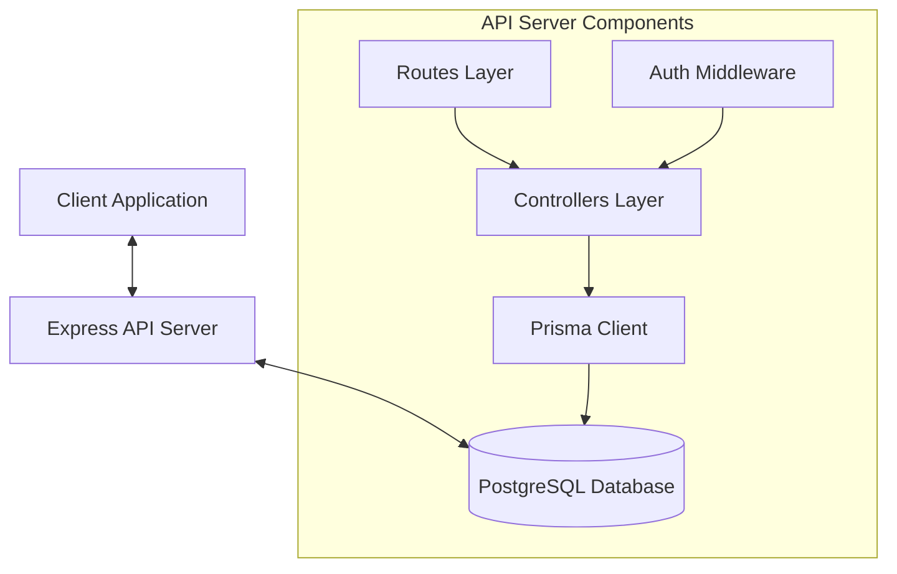
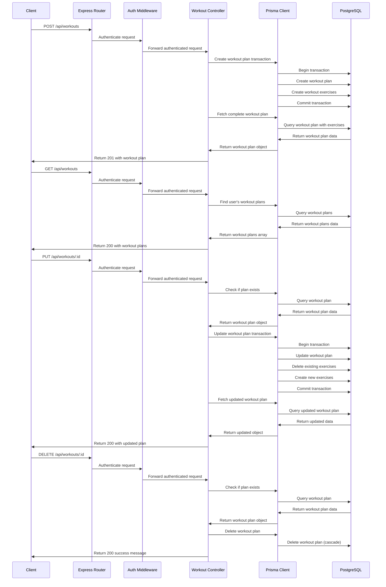
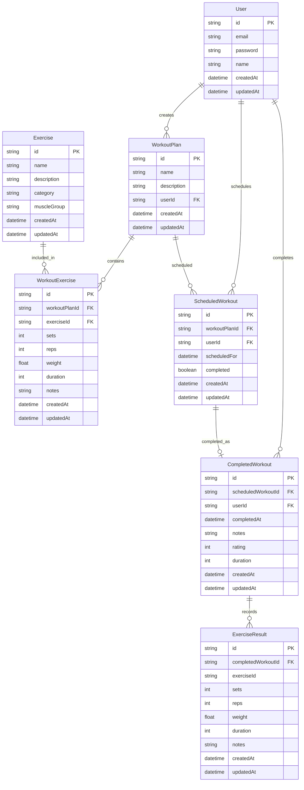

# Workout Tracker API Implementation Diagram

## System Architecture



## Workout Plan Management Flow



## Data Model Relationships



## Workout Controller Implementation

```mermaid
classDiagram
    class WorkoutController {
        +createWorkoutPlan(req: AuthRequest, res: Response)
        +getWorkoutPlans(req: AuthRequest, res: Response)
        +getWorkoutPlanById(req: AuthRequest, res: Response)
        +updateWorkoutPlan(req: AuthRequest, res: Response)
        +deleteWorkoutPlan(req: AuthRequest, res: Response)
    }
    
    class PrismaClient {
        +workoutPlan: WorkoutPlanDelegate
        +workoutExercise: WorkoutExerciseDelegate
        +$transaction(fn: Function)
    }
    
    class AuthRequest {
        +user?: {id: string, email: string}
        +body: any
        +params: any
    }
    
    class CreateWorkoutPlanDto {
        +name: string
        +description?: string
        +exercises: WorkoutExerciseDto[]
    }
    
    class WorkoutExerciseDto {
        +exerciseId: string
        +sets: number
        +reps: number
        +weight?: number
        +duration?: number
        +notes?: string
    }
    
    WorkoutController --> PrismaClient : uses
    WorkoutController --> AuthRequest : processes
    WorkoutController --> CreateWorkoutPlanDto : validates
```

## API Endpoints

| Method | Endpoint         | Description                | Authentication | Request Body            | Response                   |
|--------|------------------|----------------------------|----------------|-------------------------|----------------------------|
| POST   | /api/workouts    | Create a new workout plan  | Required       | CreateWorkoutPlanDto    | 201 Created + Workout Plan |
| GET    | /api/workouts    | Get all user workout plans | Required       | -                       | 200 OK + Workout Plans     |
| GET    | /api/workouts/:id| Get workout plan by ID     | Required       | -                       | 200 OK + Workout Plan      |
| PUT    | /api/workouts/:id| Update workout plan        | Required       | CreateWorkoutPlanDto    | 200 OK + Updated Plan      |
| DELETE | /api/workouts/:id| Delete workout plan        | Required       | -                       | 200 OK + Success message   |